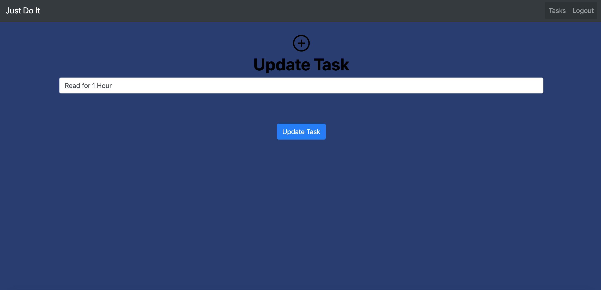

# Just Do It: A To-Do App

## Description 
The To Do Application served as an introduction to the four basic functions of persistent storage: create, read, update and delete (CRUD). 
Axios was used to make HTTP requests and Google's Firebase acted as a persistent realtime database in the cloud. 

## Technologies Used
* Axios
* Bootstrap 4
* Firebase
* HTML5 
* JavaScript
* jQuery 
* SASS
* Webpack 

## How To Run 
#### You will need a Firebase account and a new project

### 1. Configure Firebase
1. Clone the repository to a local machine.
2. Run the following command in terminal to download the web dependencies: `npm install`
3. In the db folder, rename apiKeys.json.example to apiKeys.json.
4. In Firebase, create a new project.
5. Navigate to your config object, and copy the keys from Firebase into the apiKeys.json file.
6. Create a realtime databse in Firebase, and start in test mode.
7. Import the `./db/tasks.json` file into the database to seed data.

### 2. Serve up the app
* Run `npm start` in your terminal to initiate the app.

### Contributors
[Colin White](https://github.com/colinlwhite)